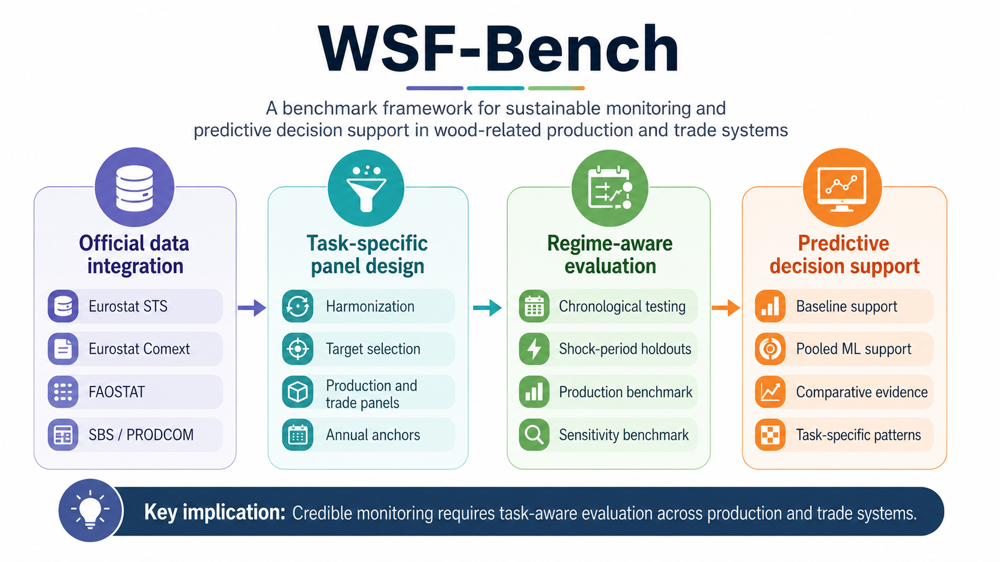

# WSF-Bench Python Core (v2.0)

This repository contains the curated data tables, Python scripts, diagnostic outputs, and figure/table generation utilities supporting WSF-Bench, a regime-aware benchmarking architecture for wood-related production and trade monitoring.

The v2.0 package supports inspection and reproduction of the revised benchmark outputs, including leakage-safe model comparisons, execution-validity diagnostics, no-fallback sensitivity summaries, additional accuracy metrics, paired statistical tests, regime-robustness indicators, recurrent-challenger results, grouped LightGBM interpretability summaries, supplementary tables, and publication figures.



## Repository Structure

```text
WSF-Bench/
|-- data/
|   |-- raw/                 # Master input workbook
|   |-- processed/           # Curated benchmark, diagnostic, and interpretability workbooks
|   `-- metadata/            # Split definitions and variable dictionary
|-- docs/                    # Data, code, and benchmark-protocol notes
|-- outputs/
|   |-- figures/             # Publication and supplementary figures in PNG, TIFF, and PDF formats
|   `-- tables/              # Supplementary table exports
|-- src/                     # Reproducible Python modules and scripts
|-- CITATION.cff
|-- LICENSE
|-- requirements.txt
`-- requirements-recurrent.txt
```

## Scope of Reproduction

The repository is designed to reproduce the reported benchmark outputs from the curated analysis files included in `data/processed/`. It is not presented as a raw-data harvesting pipeline from external statistical portals. Official-data preparation steps are documented in the manuscript and supporting notes, and the curated benchmark workbooks are provided for transparent inspection.

## Main Design Choices

- Forecasts are evaluated under fixed chronological split rules.
- Pooled LightGBM uses only information available before the forecast block.
- Fallback-contingent LightGBM outputs are retained for auditability but are not interpreted as valid pooled-learning wins.
- MASE is the primary metric; MAE, RMSE, and sMAPE are reported as supporting metrics.
- Regime-robustness indicators quantify changes in monitoring performance across pre-shock, shock, and post-shock windows.
- Grouped SHAP summaries report feature-attribution patterns for execution-valid LightGBM runs.

## Installation

```bash
python -m venv .venv
source .venv/bin/activate      # macOS/Linux
# .venv\Scripts\activate       # Windows
pip install -r requirements.txt
```

The focused recurrent challenger requires TensorFlow. Install `requirements-recurrent.txt` only if rerunning that component.

```bash
pip install -r requirements-recurrent.txt
```

## Main Entry Points

Regenerate all manuscript and supplementary figures:

```bash
python src/run_all_figures.py
```

Export supplementary tables from the diagnostics workbook:

```bash
python src/build_supplementary_tables.py
```

Rebuild diagnostics from the main benchmark workbook:

```bash
python src/build_diagnostics.py
```

Run the leakage-safe benchmark pipeline:

```bash
python src/run_leaksafe_benchmark.py
```

Run the focused trade recurrent challenger:

```bash
python src/run_trade_recurrent_challenger.py
```

## Data and Outputs

The processed workbooks in `data/processed/` contain the benchmark outputs used to generate the revised manuscript tables, diagnostic summaries, and robustness evidence. The high-resolution figure exports in `outputs/figures/` are provided in PNG, TIFF, and PDF formats. Supplementary table CSV exports are provided in `outputs/tables/`.

## Citation

If you use this repository, please cite it using the metadata in `CITATION.cff`.
